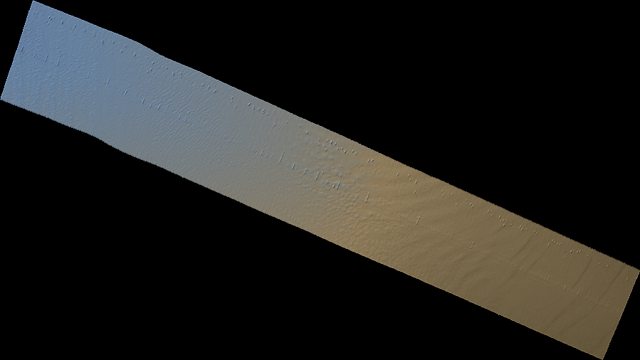
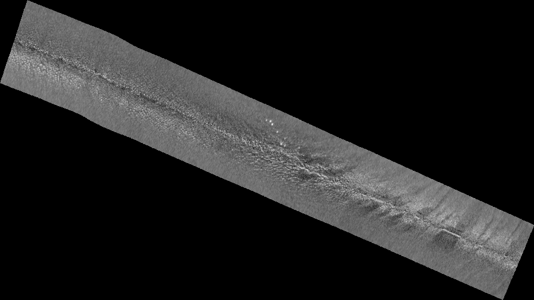

# qc.all

`qc.all` is a Python toolkit for reading **Kongsberg `.all` multibeam echosounder files**. It can:

- decode every common datagram (position, attitude, depth, runtime, sound velocity, seabed image, ...);
- build georeferenced **bathymetric point clouds** (east, north, depth, quality, reflectivity);
- rasterise soundings or reflectivity into **GeoTIFFs** (float, colour ramp or greyscale);
- expose all of the above to AI assistants through a **Model Context Protocol (MCP) server**.

- created: August 2016
- by: paul.kennedy@guardiangeomatics.com
- based on the Kongsberg ALL file specification, Revision R (October 2013)
- refreshed for Python 3.14 (originally developed for Python 3.4)

---

## Contents

- [Installation](#installation)
- [Quick start](#quick-start)
- [Example output](#example-output)
- [Using the `qc.all` module](#using-the-qc.all-module)
  - [Low-level datagram reader](#low-level-datagram-reader)
  - [Point clouds and GeoTIFFs](#point-clouds-and-geotiffs)
  - [Loader helpers](#loader-helpers)
- [Command line tools](#command-line-tools)
- [The MCP server](#the-mcp-server)
  - [Running the server](#running-the-server)
  - [Configuring an MCP client](#configuring-an-mcp-client)
  - [Available tools](#available-tools)
  - [Examples of the MCP in action](#examples-of-the-mcp-in-action)
- [Output files](#output-files)
- [Monitoring progress](#monitoring-progress)

---

## Installation

Requires **Python 3.10+** (developed/tested against 3.14).

```powershell
# from the repository root
python -m venv .venv
.\.venv\Scripts\Activate.ps1
pip install -r requirements.txt
```

`requirements.txt` pulls in `numpy`, `rasterio`, `pyproj`, `scipy`, `pyshp` and `mcp`.

A sample data file is included at `sample/0253_20140104_000401_Duke.all`.

---

## Quick start

```powershell
# summarise a file (datagram counts, position, suitable EPSG)
.\.venv\Scripts\python.exe qcall.py -i sample\0253_20140104_000401_Duke.all -info

# create a point cloud CSV + GeoTIFF for every .all file in a folder
.\.venv\Scripts\python.exe qcall.py -i sample
```

```python
# or from python
import qcall

info = qcall.getfileinfo(r"sample\0253_20140104_000401_Duke.all")
print(info["epsg"], info["datagramcounts"])

tif = qcall.depthtotif(r"sample\0253_20140104_000401_Duke.all", value="depth", colour="jeca")
print("wrote", tif)
```

---

## Example output

The colour GeoTIFFs below were gridded from the bundled `sample/sample.all` survey line -
bathymetry rendered with the `jeca` colour ramp, and seabed backscatter (reflectivity)
processed through the dedicated Angular Varied Gain (AVG) mosaic path, which flattens the
across-swath angular response so the mosaic is radiometrically balanced (no bright nadir
stripe or dark swath edges):

```powershell
# bathymetry  -> public/sample_bathymetry.tif
.\.venv\Scripts\python.exe qcall.py -i sample\sample.all -grid -value depth -colour jeca -resolution 1

# backscatter (AVG-corrected) -> public/sample_backscatter.tif
.\.venv\Scripts\python.exe qcall.py -i sample\sample.all -grid -value reflectivity -colour grey -resolution 1
```

**Bathymetry (depth, `jeca` colour ramp)**



**Backscatter (reflectivity, AVG-corrected greyscale)**



The full-resolution GeoTIFFs are georeferenced (EPSG:32751 for this line) and open
directly in QGIS, ArcGIS or any GIS package.

---

## Backscatter Angular Varied Gain (AVG)

Raw seabed backscatter has a strong dependence on beam angle - the seabed reflects much
more energy near nadir than at grazing angles - so a raw mosaic shows a bright nadir stripe
and dark swath edges. `backscattertotif()` removes this by characterising the angular
response (mean backscatter vs beam angle from nadir) and subtracting that trend from every
sounding before gridding.

### Persistent, accumulating AVG curve

A single survey line rarely contains enough soundings to resolve the sharp nadir response,
so a per-file AVG leaves a residual nadir spike. To fix this the AVG curve is **persisted to
disc and accumulated across every file processed**. Each store keeps a per-angle-bin running
sum and count of backscatter on a fixed -90&deg;..+90&deg; grid (default bin size 0.5&deg;),
so each new file simply adds to it and the running-mean curve steadily improves - resolving
and removing the nadir spike as more files are processed.

### How the store is keyed (serial number + depth mode)

The angular response is a property of the **sonar** and the **acoustic mode** it was running in. Each
AVG curve is therefore keyed by:

- **Transducer serial number** - taken from the **first Installation (`I`) datagram's
  `serialnumber` field** (the primary sonar head / system serial). This is *not* a port/stbd
  designation: the `.all` install record carries `serialnumber` (head 1) and
  `Secondaryserialnumber` (head 2, non-zero only on dual-head systems such as a twin-head
  EM2040/EM3002). The store currently keys on the primary serial only.
- **Depth mode** - taken from the **runtime (`R`) datagram's `depthmode`** (e.g. `Shallow`,
  `Medium`, `VeryDeep`, or `300kHz`/`400kHz` on EM2040), since the angular response differs
  between modes.

Stores live in an `avgcache/` folder beside the module (override with `avgdir`), one JSON file per
(serial, depth mode, bin size):

```text
avgcache/avg_<serialnumber>_<depthmode>_<binsize>deg.json   e.g. avg_105_Shallow_0.5deg.json
```

### Per-line correction, store-assisted

Although the store accumulates across all files, the **nadir specular strength also varies line to
line** (with absolute depth and seabed type) even within one depth mode, so a *pooled* average curve
under-corrects any line whose nadir is brighter than average - leaving a bright nadir stripe. Each
line is therefore flattened against **its own per-angle response** wherever it has enough soundings in
a bin (true for every near-nadir bin on a normal line); the accumulated store is used only to fill
sparse bins on short lines. On the test data this took the residual mosaic nadir excess from **3.7 dB
(pooled) down to ~0.1 dB (per-line)**.

### Options

```python
import qcall

f = r"sample\0106_20131224_160458_Duke.all"

# AVG-corrected mosaic (default) - accumulates into the persistent store
avg = qcall.backscattertotif(f, resolution=2, colour='grey')

# reference mosaic BEFORE AVG - grids raw backscatter, does NOT touch the store
raw = qcall.backscattertotif(f, resolution=2, colour='grey', applyavg=False)
```

| Parameter | Default | Meaning |
| --- | --- | --- |
| `applyavg` | `True` | `False` grids raw (uncorrected) backscatter - a reference mosaic. Output is named `_backscatter_raw_...` vs `_backscatter_avg_...`. |
| `useavgstore` | `True` | `False` uses a per-file AVG only (no disc store). |
| `anglebinsize` | `0.5` | Width in degrees of the AVG angle bins. |
| `avgdir` | `''` | Folder for the persistent store. Empty uses `avgcache/` beside the module. |
| `gridstat` | `'mean'` | Per-cell reducer: `'mean'` (smooth tones - reflectivity is 0.5 dB quantised, so `'median'` posterizes the contrast), `'median'` or `'trimmed'` (10% trimmed mean). |
| `despikepings` | `0` | Optional light along-track running-median window (pings). Off by default - it smooths along-track and lowers apparent resolution. |
| `nadirmaskdeg` | `2.5` | Drop soundings within this many degrees of nadir (the unreliable specular zone) to remove the bright nadir line. `0` keeps the nadir. |
| `nadirfill` | `True` | Interpolate backscatter across the thin nadir gap left by `nadirmaskdeg` (confined to interior cells, so swath edges are never extrapolated). |
| `nadirdespikepings` | `0` | Optional longer along-track median window on near-nadir beams. Not recommended (reinforces the nadir stripe); prefer `nadirmaskdeg`. |
| `greystretch` | `'minmax'` | Greyscale tone mapping: `'minmax'` (full-range linear - smooth, low-contrast, keeps dark detail), `'percentile'` (clip tails) or `'stddev'` (mean ± `greysigma`·σ). |
| `greysigma` | `2.5` | Standard deviations each side of the mean for `'stddev'`. |
| `greygamma` | `1.0` | Gamma on the 0-1 tones. `<1` lifts shadows, `>1` darkens. |
| `infill` | `True` | Interpolate across empty cells inside the swath (the stipple a finer grid leaves between soundings), leaving the swath edges / outside-swath nodata untouched. |
| `minspeedmps` | `0` | Drop pings slower than this (m/s) - trims line-start/turn slow-downs. Off by default. |
| `maxturnratedegs` | `0` | Drop pings whose heading turn-rate exceeds this (deg/s) - trims line turns. Off by default. |

### The nadir line and how it is removed

After the per-line AVG flattens the *mean* angular response, a sharp **bright hairline can remain
along the nadir**. Investigation showed this is **not** random speckle and **not** a geometric error
(the per-ping nadir peak angle does not correlate with vessel roll, r &asymp; -0.10, or seabed slope,
r &asymp; -0.20): it is **consistent specular energy** in the innermost beams. A mean AVG cannot
remove it, and along-track smoothing only reinforces it into a continuous bright stripe.

The robust solution - as used by production backscatter mosaickers - is to **drop the nadir beams**
(`nadirmaskdeg`, default 2.5&deg;) and **interpolate across the thin gap** (`nadirfill`, default on). On
a single line this yields a smooth, gap-free mosaic with the bright line gone; across an overlapping
survey the neighbouring lines' outer beams cover the nadir completely. A light `despikepings` median
and robust `median` cell gridding clean up the remaining speckle.

---

## Using the `qc.all` module

### Low-level datagram reader

The `allreader` class streams through a file. `readdatagram()` returns the datagram
type code and a class instance; you then call `.read()` on the records you care
about, which keeps scanning fast.

```python
import qcall

r = qcall.allreader(r"sample\0253_20140104_000401_Duke.all")

while r.moredata():
    typeofdatagram, datagram = r.readdatagram()

    if typeofdatagram == 'P':            # position
        datagram.read()
        print("Lat: %.5f Lon: %.5f" % (datagram.latitude, datagram.longitude))

    if typeofdatagram == 'X':            # XYZ depth
        datagram.read()
        nadir = int(datagram.nbeams / 2)
        print("Nadir depth: %.2f m" % datagram.depth[nadir])

r.rewind()
r.close()
```

Common datagram codes: `P` position, `A`/`n` attitude, `C` clock, `D`/`X` depth,
`N`/`f` raw range & travel time, `R` runtime parameters, `U` sound velocity profile,
`Y` seabed image, `I`/`i` installation, `h` height, `3` extra parameters.

### Point clouds and GeoTIFFs

```python
import qcall

filename = r"sample\0253_20140104_000401_Duke.all"
params = {'epsg': '0', 'odir': 'out', 'debug': '-1', 'verbose': False}

# build a point cloud (east, north, depth, quality, reflectivity)
cloud = qcall.loaddata(filename, params)
print(len(cloud.xarr), "points")
print(cloud.xarr[0], cloud.yarr[0], cloud.zarr[0], cloud.qarr[0], cloud.rarr[0])

# write a CSV (_R.txt) + float GeoTIFF in one step
geotiff = qcall.all2point(filename, params)

# or grid directly with colour / reflectivity options
shaded = qcall.depthtotif(filename, resolution=2, value='reflectivity', colour='grey')
```

`epsg='0'` auto-detects a suitable projected CRS from the file's first position.

### Loader helpers

These functions read a whole file and return ready-to-use Python/NumPy data:

| Function | Returns |
| --- | --- |
| `getfileinfo(file)` | datagram counts, position, file size, suitable EPSG |
| `getsuitableepsg(file)` | a projected EPSG code for the survey area |
| `loaddata(file, params)` | a point cloud object (`xarr`, `yarr`, `zarr`, `qarr`, `rarr`) |
| `loadpositions(file)` | position records |
| `loadattitude(file)` | attitude array `[timestamp, roll, pitch, heave, heading]` |
| `significantattitude(file)` | significant wave height / roll / pitch (4×σ) |
| `loadclock(file)` | clock records |
| `loadheight(file)` | height records |
| `loadsoundvelocityprofiles(file)` | SVP datagrams |
| `loadsurfacesoundspeed(file)` | surface sound speed datagrams |
| `loadruntimeparameters(file)` | decoded runtime settings |
| `loadtraveltime(file, max)` | raw range / beam-angle records |
| `loadinstallationparameters(file)` | installation offsets and serials |
| `loaddepth(file, maxpings)` | per-beam soundings |
| `loadseabedimage(file, maxpings)` | seabed image backscatter samples |
| `loadpustatus(file)` | PU status / sensor health records |

---

## Command line tools

`qcall.py` reads a file (or folder) and writes a point cloud CSV plus a GeoTIFF.

```powershell
.\.venv\Scripts\python.exe qcall.py -i <file-or-folder> [options]
```

| Option | Default | Description |
| --- | --- | --- |
| `-i` | current folder | Input `.all` file or a folder of `.all` files |
| `-epsg` | `0` (auto) | Output EPSG code, e.g. `-epsg 32756` |
| `-odir` | timestamped folder | Output folder |
| `-debug` | `-1` (all) | Number of pings to process (`-1` = all) |
| `-verbose` | off | Verbose logging / extra supporting files |
| `-info` | off | Just print a summary of each file and exit |

If no `-i` is given it processes every `.all` file in the current directory.

---

## The MCP server

`qcall_mcp.py` is a [Model Context Protocol](https://modelcontextprotocol.io) server
built with `FastMCP`. It exposes the qc.all functionality as tools that an AI
assistant (Claude Desktop, VS Code, etc.) can call. It runs blocking work on a
dedicated worker thread pool so several requests execute in parallel, and depends
only on the `qc.all` module.

Over HTTP the server runs **stateful** sessions: every connecting client is issued
its own `Mcp-Session-Id`, and concurrent requests from different sessions are
serviced in parallel (the numpy/rasterio gridding and point-cloud tools release the
GIL, so they genuinely run at the same time). This lets multiple users fetch data
simultaneously without blocking one another.

### Running the server

For a local client on the same machine, run it over the **stdio** transport
(the default). The client normally launches it for you:

```powershell
.\.venv\Scripts\python.exe qcall_mcp.py
```

To run it on a **VM / shared server** so other machines on the office network can
reach it, run it over **HTTP** (the *streamable-http* transport) and confine file
access to your survey data folder(s):

```powershell
.\.venv\Scripts\python.exe qcall_mcp.py --http --host 0.0.0.0 --port 8000 --root D:\surveydata
```

| Option | Default | Description |
| --- | --- | --- |
| `--http` | off | Serve over HTTP (shorthand for `--transport streamable-http`). |
| `--transport` | `stdio` | `stdio`, `http` / `streamable-http`, or `sse`. |
| `--host` | `127.0.0.1` | Interface to bind. Use `0.0.0.0` to accept connections from other machines. |
| `--port` | `8000` | TCP port to listen on (HTTP/SSE only). |
| `--root` | none | Folder that **all** file paths and file-system tools are confined to. Repeat for several folders. |

Each option also has an environment variable equivalent: `QCALL_MCP_TRANSPORT`,
`QCALL_MCP_HOST`, `QCALL_MCP_PORT` and `QCALL_MCP_ROOT` (the latter is
`os.pathsep`-separated for multiple roots).

When the HTTP server is running, its MCP endpoint is
`http://<host>:<port>/mcp` (or `/sse` for the SSE transport).

> **Security:** the file-system tools let a connected client read and list files
> on the host VM. Always pass one or more `--root` folders when serving over HTTP
> so access is confined to your survey data — every path argument is resolved and
> rejected if it escapes those roots (no `..` traversal). Bind to `0.0.0.0` only
> on a trusted network / behind a firewall; the server has no built-in
> authentication.

### Running in Docker

The repo ships a `Dockerfile`, `.dockerignore` and `docker-compose.yml` so the
HTTP server can run as a container (e.g. on an office VM). The image serves the
*streamable-http* transport on port `8000` and confines all file access to
`/data`, which you mount from the host.

**Build the image:**

```powershell
docker build -t qcall-mcp .
```

**Run it**, mounting your survey-data folder at `/data` and publishing the port:

```powershell
# read-only data mount (recommended if the server only needs to read .all files)
docker run --rm -p 8000:8000 -v C:\surveydata:/data:ro qcall-mcp

# read-write (needed if you want GeoTIFF/CSV outputs written back to the host)
docker run --rm -p 8000:8000 -v C:\surveydata:/data qcall-mcp
```

**Or with Docker Compose** (edit the `volumes:` line to point at your data):

```powershell
docker compose up -d      # start in the background
docker compose logs -f    # watch the startup banner / processing log
docker compose down       # stop
```

**Or use the helper script** `docker_mcp.bat` (Windows) — edit the `DATA` /
`PORT` settings at the top, then:

```powershell
docker_mcp.bat            # build the image, then run it
docker_mcp.bat build      # build only
docker_mcp.bat run        # run the existing image (no rebuild)
docker_mcp.bat stop       # stop and remove the container
```

The MCP endpoint is then `http://<host>:8000/mcp`. The container is configured
through the same environment variables as the script — override any of them with
`-e`:

| Variable | Default in image | Purpose |
| --- | --- | --- |
| `QCALL_MCP_TRANSPORT` | `http` | Transport (`http`, `sse` or `stdio`). |
| `QCALL_MCP_HOST` | `0.0.0.0` | Bind address inside the container. |
| `QCALL_MCP_PORT` | `8000` | Port (also `EXPOSE`d and published). |
| `QCALL_MCP_ROOT` | `/data` | Folder file access is confined to. |
| `QCALL_LOG_DIR` | `/data/logs` | Shared rotating log location. |

The container runs as a non-root user and includes a TCP health check, so
`docker ps` reports it as *healthy* once the server is accepting connections.

> **Security:** the same confinement and network warnings as above apply — only
> the mounted `/data` folder is reachable, and the server has no built-in
> authentication, so expose the published port only on a trusted network.

### Configuring an MCP client

**Local (stdio).** Add an entry like this to your client's MCP configuration
(paths are examples — use the absolute paths to your venv and repo):

```json
{
  "mcpServers": {
    "qcall": {
      "command": "C:\\ggtools\\qcall\\.venv\\Scripts\\python.exe",
      "args": ["C:\\ggtools\\qcall\\qcall_mcp.py"]
    }
  }
}
```

**Remote (HTTP on a VM).** Point the client at the server's URL instead of
launching a command:

```json
{
  "mcpServers": {
    "qcall": {
      "url": "http://my-office-vm:8000/mcp"
    }
  }
}
```

**Claude Desktop (`claude_desktop_config.json`) — both at once.** Claude Desktop
launches each `mcpServers` entry as a local command (stdio). To also reach an
HTTP server, add a second entry that bridges to the URL with
[`mcp-remote`](https://www.npmjs.com/package/mcp-remote) (requires Node.js, which
provides `npx`). Start the HTTP server first (`qcall_mcp.py --http ...`):

```json
{
  "mcpServers": {
    "qcall": {
      "command": "C:\\ggtools\\qcall\\.venv\\Scripts\\python.exe",
      "args": ["C:\\ggtools\\qcall\\qcall_mcp.py"]
    },
    "qcall-http": {
      "command": "npx",
      "args": ["-y", "mcp-remote", "http://my-office-vm:8000/mcp"]
    }
  }
}
```

The `qc.all` entry runs locally over stdio; the `qcall-http` entry connects to the
already-running HTTP server. Restart Claude Desktop after editing the file.

**VS Code (`.vscode/mcp.json`).** VS Code uses a slightly different schema and can
hold both a local (stdio) and a remote (HTTP) entry at once. A ready-to-use file
is included in this repo at [`.vscode/mcp.json`](.vscode/mcp.json):

```json
{
  "servers": {
    "qcall": {
      "type": "stdio",
      "command": "${workspaceFolder}/.venv/Scripts/python.exe",
      "args": ["${workspaceFolder}/qcall_mcp.py"]
    },
    "qcall-http": {
      "type": "http",
      "url": "http://localhost:8000/mcp"
    }
  }
}
```

Start the HTTP server yourself (`qcall_mcp.py --http ...`) before starting the
`qcall-http` entry; the `qc.all` (stdio) entry is launched by VS Code for you.

### Available tools

**File system access** (browse the host VM for files — most useful over HTTP)

| Tool | Purpose |
| --- | --- |
| `get_server_info` | Report the allowed root folder(s), shared status/log file paths, the async (job) tools and the list of tools. |
| `list_directory` | List files and sub-folders in a directory. |
| `find_files` | Glob for files (e.g. `*.all`, `*.tif`, `*_R.txt`), optionally recursive. |
| `stat_path` | Metadata (type, size, modified time) for one path. |
| `read_text_file` | Read a slice of a text output (point cloud CSV or log). |

**File transfer** (move files to/from a remote HTTP server)

| Tool | Purpose |
| --- | --- |
| `download_file` | Download a processed output — GeoTIFF (`.tif`), XYZ/CSV (`*_R.txt`) or log — as base64 (supports chunked paging). |
| `copy_file` | Copy a file already on the server (e.g. on a mounted survey drive) into a working folder — no upload/base64 needed. |

Uploads use the streaming `PUT /upload/<filename.all>` HTTP endpoint (see below)
rather than an MCP tool, so large `.all` files transfer in a single request.

**Processing / gridding** (the GeoTIFF / point-cloud / batch tools run as background **jobs**)

| Tool | Purpose |
| --- | --- |
| `get_file_info` | Summarise a file (datagram counts, position, EPSG). |
| `get_depth_raster` | Grid depth to a GeoTIFF (float / colour / grey). Returns a `job_id`. |
| `get_backscatter_raster` | Grid seabed backscatter (reflectivity) to a GeoTIFF. Returns a `job_id`. |
| `get_pointcloud` | Export the point cloud as a CSV. Returns a `job_id`. |
| `batch_process` | Process every `.all` file in a folder concurrently. Returns a `job_id`. |
| `get_job_status` | Poll a `job_id` until `complete`; the result holds the output path(s). |
| `list_jobs` | List recent/running jobs (compact summaries). |

Long-running tools return a `job_id` immediately instead of blocking the request
(which would time out on most transports around 30 s). Poll `get_job_status(job_id)`
until its `status` is `complete` (or `error`); the `result` then carries the exact
output path (`geotiff` / `pointcloud_csv`) ready for `download_file`. `list_jobs`
shows what is running or recently finished. Live progress is also visible on the
`/monitor` page and in `qcall_status.json` (see `get_server_info` → `status_file`).

**Datagram record access**

| Tool | Record |
| --- | --- |
| `get_positions` | `P` position |
| `get_attitude` | `A` attitude |
| `get_significantwaveheight` | `A` heave/roll/pitch → significant wave height, roll, pitch (4×σ) |
| `get_depth` | `X`/`D` per-beam soundings (compact CSV by default; `format="columns"` for arrays) |
| `get_depth_stats` | `X`/`D` soundings → min/max/mean/std/percentiles + depth histogram (no raw points) |
| `get_network_attitude` | `n` network attitude |
| `get_clock` | `C` clock |
| `get_height` | `h` height |
| `get_sound_velocity_profiles` | `U` sound velocity profile |
| `get_surface_sound_speed` | `G` surface sound speed |
| `get_runtime_parameters` | `R` runtime parameters |
| `get_travel_time` | `N` raw range & beam angle |
| `get_installation_parameters` | `I` installation |
| `get_seabed_image` | `Y` seabed image backscatter |
| `get_pu_status` | `1` PU status / sensor health |

Large records accept `max_records` / `max_pings` / `max_points` arguments so
responses stay a manageable size; results report a `truncated` flag and the true
`count`.

**Remote workflow (upload → process → download).** When the server runs over HTTP
on another machine you can drive the whole pipeline without shared drives:

1. `PUT /upload/<filename.all>` — stream the `.all` file to the server in one
   request (no chunking); the JSON response gives you the saved `path`.
2. `get_depth_raster` / `get_backscatter_raster` / `get_pointcloud` — process that path.
3. `download_file` — pull back the resulting GeoTIFF (`.tif`) or point cloud
   (`*_R.txt`). Binary and text files both come back base64-encoded; for large
   files keep requesting with the returned `next_offset` until `eof` is true.

File content is base64 in JSON (≈33% larger on the wire) and each call is capped
at 64 MB, so very large transfers are paged/chunked. All paths stay confined to
the configured `--root` folder(s).

**Streaming HTTP upload / download (large files, no chunking).** The MCP tools above
carry bytes as base64 inside JSON-RPC. For large files the server also exposes two
plain-HTTP routes on the *same* host/port that stream straight to/from disk in constant
memory, so a client sends or fetches a whole file in a single request with no upfront
chunking:

| Method | Route | Purpose |
| --- | --- | --- |
| `PUT` / `POST` | `/upload/<filename.all>` | Stream a `.all` file body to disk. Query: `output_dir`, `overwrite=true`. |
| `GET` | `/download/<root-relative-path>` | Stream any output file back (honours HTTP `Range`). |

```bash
# upload a 90 MB survey file in one request
curl -T 0102_20131224_132401_Duke.all "http://host:8000/upload/0102_20131224_132401_Duke.all?overwrite=true"

# download a processed GeoTIFF (‑OJ keeps the server-provided filename)
curl -OJ "http://host:8000/download/0102_..._Duke.all_depth_jeca_2m.tif"
```

These routes stay confined to the configured `--root` folder(s) and only accept
`.all` filenames for upload, exactly like the file-system tools.


### Examples of the MCP in action

Once the server is connected, you interact with it in natural language and the
assistant calls the tools for you. A few illustrative prompts and the tool calls
they map to:

> **"Summarise `sample/0253_20140104_000401_Duke.all` — where was it collected and what EPSG should I use?"**

calls `get_file_info` →

```json
{
  "filename": "sample/0253_20140104_000401_Duke.all",
  "filesize": 12648448,
  "approxlongitude": 174.78,
  "approxlatitude": -36.42,
  "epsg": "32760",
  "datagramcounts": { "P": 421, "A": 1683, "X": 842, "R": 5, "U": 2 }
}
```

> **"Make a coloured depth GeoTIFF of that file at 2 m resolution."**

calls `get_depth_raster` with `colour="jeca"`, `resolution=2` →

```json
{
  "input_file": "sample/0253_20140104_000401_Duke.all",
  "value": "depth",
  "colour": "jeca",
  "resolution": 2,
  "geotiff": "sample/0253_..._Duke.all_depth_jeca.tif"
}
```

> **"Now grid the reflectivity in greyscale instead."**

calls `get_backscatter_raster` with `colour="grey"`.

> **"Export the point cloud to CSV so I can load it in CloudCompare."**

calls `get_pointcloud` →

```json
{
  "input_file": "sample/0253_20140104_000401_Duke.all",
  "epsg": "32760",
  "output_dir": "sample/all2point_20260620-101500",
  "pointcloud_csv": "sample/all2point_.../0253_..._Duke.all_R.txt",
  "point_count": 215463
}
```

> **"Process the whole `sample` folder into GeoTIFFs, 4 files at a time."**

calls `batch_process` with `input_folder="sample"`, `max_concurrency=4` → a list of
per-file results, each with its `geotiff` path and any `error`.

> **"Check the clock stability and show me the first few runtime settings."**

calls `get_clock` and `get_runtime_parameters` and returns the decoded records
(PC vs external time / PPS, depth mode, filters, coverage, etc.).

You can quickly verify the tools are registered without a client:

```powershell
.\.venv\Scripts\python.exe -c "import asyncio, qcall_mcp; print(sorted(t.name for t in asyncio.run(qcall_mcp.mcp.list_tools())))"
```

---

## Output files

- `<file>_R.txt` — CSV point cloud: `east, north, depth, quality, reflectivity`.
- `<file>_..._depth.tif` / reflectivity tif — GeoTIFF raster (float, colour ramp or greyscale).
- `logs/qcall.log` — a single **shared, rotating** run log used by both the CLI and the
  MCP server (rotates at 5 MB, 5 backups). Override the location with the
  `QCALL_LOG_DIR` environment variable.
- `qcall_status.json` — current job/progress, written to `logs/` (and a copy into each
  output folder) for the monitor.

---

## Monitoring progress

When the MCP server runs over HTTP it also serves the monitor web page on the
**same port** at **`/monitor`** (e.g. `http://<host>:8000/monitor`). This means a
single port is all you need to publish — convenient when running in Docker. The
page shows the live status and shared log, auto-refreshing every few seconds.

You can also run the monitor as a standalone server (e.g. alongside the CLI, or on
a different machine):

```powershell
.\.venv\Scripts\python.exe monitor.py
# then open http://127.0.0.1:8770/
```

By default it watches the shared log folder (`QCALL_LOG_DIR`, or a `logs/` folder next
to the scripts), so it shows everything the MCP server processes — point it elsewhere
with `--dir`. `launch_mcp.bat` starts this monitor automatically and opens it in your
browser.

---

## Notes on data types

Kongsberg fields map to Python `struct` format characters as follows:

| ALL type | Bytes | `struct` |
| --- | --- | --- |
| signed char | 1 | `b` |
| unsigned char | 1 | `B` |
| signed short | 2 | `h` |
| unsigned short | 2 | `H` |
| DWORD (unsigned int) | 4 | `L` |
| char | 1 | `c` |
